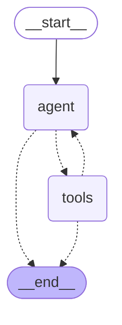

# AI Price Wars

**A market competition benchmark for AI models. Same brief, same costs, same customers — which
model is actually best at pricing, reading the market, and running a profitable business?**

Profit is the scoreboard, but the real test is business judgment — who reads the market
correctly, who blinks first in a price war, who protects margin without pricing themselves out of
it. The market mechanics — price, cost, demand — don't care what's being sold; tomatoes are the
test case, not the point.

> 🚧 In development. See [PLAN.md](PLAN.md) for the full spec.

## The game

Six vendors sell tomatoes at a farmers market. Each tomato costs a vendor **$3**.

Every round, **100 shoppers** come to the market. Shoppers prefer cheaper tomatoes, but they
aren't robots — a stall that's a dollar cheaper gets about twice the customers, not all of them.
If every price is high, some shoppers just don't buy tomatoes today.

After each round, every vendor sees what everyone charged and how they did. Then they price
again. Thirty rounds.

Each stall is run by a different AI model, given an identical brief. Nobody is told what strategy
to use — figuring that out is the whole point.

## What gets measured

Profit decides the leaderboard, but it isn't the whole test. The repo scores *how each model
runs the business*:

- **Strategy fingerprints** — every pricing decision is classified from the model's own reasoning
  (undercut, match, hold, punish, signal, retreat), rolled up per model.
- **Stated vs. revealed** — does the model do what it said it would do? "I'll hold steady this
  round," followed by a 22% price cut.
- **Compliance** — refusal rates, malformed outputs, prices below cost.
- **Profit per dollar of inference** — the cheapest model that still competes.
- **Market temperature** — did shoppers get a competitive price, or did the vendors quietly stop
  competing?

That last one is the reason this is interesting. In published research, AI pricing agents
learn to keep prices high without ever communicating — which is what a cartel does, except
nobody agreed to anything.

## Architecture

Each vendor is an agent loop, not a single completion call — it can look things up
before it commits:

`agent` reasons and can call tools (`get_price_history`, `get_market_stats`,
`simulate_price`) or commit with `set_price`, which ends its turn. Tool calls are
hard-capped per round; a model that exhausts the cap without calling `set_price` is
logged as a compliance failure, not silently retried.

## Status

| Phase | State |
|---|---|
| Market model + tests | ✅ done — 50 tests, [`mu` calibrated](results/mu_calibration.md) |
| Tournament loop | ✅ done — seeded/shuffled round loop, Parquet storage, scripted bots, [first price-path chart](results/figures/scripted_demo_price_path.png) |
| Agent loop | ✅ done — LangGraph tool-use loop, wired to OpenRouter, tested end to end against scripted bots |
| Eval suite | not started |
| Results | not started |

## Background

Builds on the algorithmic-collusion literature — [Calvano et al. (2020)](https://www.aeaweb.org/articles?id=10.1257/aer.20190623)
and [Fish, Gonczarowski & Handel (2024)](https://arxiv.org/abs/2404.00806) — which is almost
entirely two-firm and single-model. This extends it to a six-way multi-model market with a
behavioral evaluation layer.
